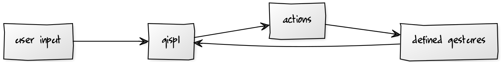

# Implementation overview

As already mentioned, for some kind of an input to be recognized as a gesture, we can break down the work into roughly three steps:

* defining what a gesture is -- this is GISpL as a definition language

* recognizing input as a defined gesture -- this is what GISpL.js mainly does

* performing an action based on a recognized gesture -- this is the responsibility of the user implementing a gesture

Although the most important part of GISpL.js is to recognize user input as a gesture, it also needs to be able to accept gesture definitions, and to allow a user to assign a gesture action. The first part is not difficult because GISpL uses JSON as a definition language, and as described by the JSON author, JSON is just a subset of JavaScript [@jsonrfc]. Therefore, parsing JSON is trivial, and additionally it is not even necessary for a definition to be in JSON format; a simple JavaScript object is suitable as well.

For the last part, GISpL.js was designed and built in a way that is typical for JavaScript and the browser. Actions based on user input are usually assigned as callback functions or listeners for a particular event. For instance, every page node, e.g. an html tag, inherits from EventTarget [@eventtarget] and thus contains `addEventListener` and similar methods which can be used to assign actions based on user clicks, mouse movement, scroll etc. Libraries such as jQuery have further simplified this by using simple `on` and `off` methods that can assign built in and custom event actions to page elements.

GISpL.js draws inspiration from jQuery and many other libraries by defining a gispl object that contains a collection or list of elements (so called array-like objects). Additionally, the gispl object contains `on` and `off` methods to add callback functions to the elements in the collection, with the events in this case representing gestures. As shown in Figure {@fig:overview}, a user is responsible for defining a gesture according to the GISpL specification that is plugged into GISpL.js; it also needs to specify the elements for the gesture and and action, or actions, that will be executed once the gesture is recognized; GISpL.js will take care of recognizing user input and executing all of the defined actions for a particular element.

{#fig:overview}

Reusing the gesture definition example from the [Introduction](#introduction), a user could implement a gesture as follows:

```
// define a gesture
var twoFingeredMotion = {
    name: "two-fingered-motion",
    features: [
        {type: "Motion"},
        {type": Count, constraints: [2,2]}
    ]
};

// add a gesture definition to a list of gestures
gispl.addGesture(twoFingeredMotion);

// select all images and define behavior when gesture recognized
gispl('img').on(twoFingeredMotion.name, function action() {
    console.log('two fingered motion over an image');
});
```

In this simple example, once a two-fingered motion gesture over any image on the page is recognized, a simple message stating this fact will be logged to the console.

## Extending Tuio.js

GISpL.js gets its input using TUIO, making it necessary to understand TUIO and its several input types, including different protocol versions. There already exists [@tuiojsfelix] a TUIO implementation in JavaScript called Tuio.js, but at this point it has two deficiencies: it is several years old and supports only the first version of TUIO, and it does so by using an intermediate server running in Node.js. This server picks up information sent over UDP by a TUIO server, transforms this data into JavaScript data that is in the end sent using socket.io (typically WebSocket) to a browser.

Although this is a good solution for situations where a TUIO server is not able to communicate directly with the browser, TUIO 2.0 reference implementation and also e.g. reacTIVision have support for this feature. For this reason Tuio.js needed to be extended in order to not only connect and receive data over WebSocket, but also to actually decode the incoming data into JavaScript objects. This was accomplished by integrating a third party library called osc.js; as stated by the author of TUIO, this protocol was implemented on top of OSC -- Open Sound Protocol -- and follows its syntax [@tuio2spec]. It is therefore possible to decode TUIO data with a library such as osc.js which in principle deals with OSC data.

Furthermore, TUIO 2.0 is not backwards compatible to TUIO 1.0 [@tuio2spec], and in order to support the second version it was necessary to extend Tuio.js to support the new message structure and new input data types.

The end result is that GISpL.js integrates an extended version of Tuio.js that does not need to depend on an intermediate server which supplies data to the browser. Additionally, it also supports TUIO 2.0, and the enhancements either simplify the usage greatly or add a broader support for various TUIO capable input devices.

## Recognizing gestures

At this point, we can add gesture definitions and attach gestures' corresponding actions to page elements, but of course we need a way of actually recognizing user input as a GISpL defined gesture. That is the central topic of this work, and it will be discussed in later chapters, but in a high level overview it is also simple:

1) for all nodes with input
2) validate all registered gestures
3) if valid, execute all registered callbacks for the gesture

 A simplified version of the code is available below.

```
nodesInput.forEach(function forAllNodes(inputObjects, node) {
    userDefinedGestures.forEach(function forAllGestures(gesture) {
        if (gesture.load(inputObjects)) {
            let eventName = gesture.name()
            events.emit(node, eventName);
        }
    });
});
```
## From recognition to action
