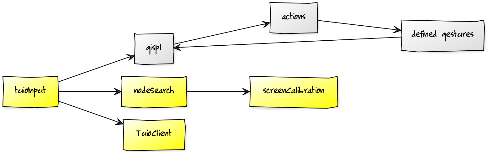

# Managing User Input

All three parts of the implementation could be valid starting points, but we start with the user input for two reasons. First, user input is the actual starting point, and the part which will in fact trigger the series of events that might lead to a gesture being recognized. Without user input, all other parts of the library will never be used. Second, and more importantly, the type of the user input mandates additional work that would normally not be required in a browser. Thus, this needs to be taken care of first, in order for GISpL to work at all, or to be aware of constraints, if any.

As already mentioned, in its current form GISpL.js uses TUIO as its input source, which has advantages that were already discussed, but also one important disadvantage. Typically, the browser is an environment that takes care of many things in the background. In the case of user input, this means that when it receives input, be it a mouse click or the use of a touchscreen, it will automatically locate the HTML element on the page that received the input. For example, waiting for touchscreen input could be setup like this:

```
var element = document.getElementById('someElementId');
// attach behavior to run when input received
element.addEventListener('touchstart', userDefinedFunction);
```

This means that the user only needs to define a `function` that will be executed once the user interacts with the specified element, and never deals with actually locating the element based on user input. In the case of TUIO this is however not the case. TUIO works outside of the browser, and supplies to it only the relative screen position, e.g. `(0.5, 0.5)` for the x and y coordinates when the user touches the exact center point of the screen. There are two problems with this:

* we do not know which page elements are receiving user input

* screen coordinates usually do not match the browser coordinates

The first problem is simple to solve because all browsers support retrieving the top most element based on x and y coordinates. This is accomplished by using `document.elementFromPoint(x, y)`, which will return either an `HTMLElement` object or `null` if none found, e.g. the coordinates are negative or outside of the visible browser area [@elementfrompoint]. The x and y coordinates that get passed into this method are however browser viewport coordinates, and not the screen coordinates received from a TUIO source.

This leads us to the second problem. Browsers contain several standard or even non-standard properties that give different types of information related to its position on the screen, usually attached to the global `window` object. For instance, `window.screenY` gives the distance of the browser's top border from the top of the screen [@screeny]. However, as it turns out, there is no specific way of finding out what the screen position of the top left corner of the viewport is.

## Searching for elements

In terms of screen coordinates, element's position on the page can be stated using many different reference points. As pointed out in [@viewports], obviously there is the screen itself, which is rarely important; additionally, there is the page or the document, and finally there is the viewport, which represents the area of the page currently visible within the browser, with the other parts of the page reachable by scrolling.

Because we need to use viewport coordinates, and we have only the screen coordinates, there is an obvious need to transform the latter to the former. In practice this means that we need to shift all of our input coordinates to left and top according to the distance of the viewport origin from the screen's origin, i.e. the top left corner. If browsers would contain this information, there would be no issue, but they do not.

The simplest solution would be to limit the use of GISpL to when the browser is occupying the whole screen. In this case the screen and the viewport coordinates match, but this would be a relatively large constraint for the user. Another possibility that brings us closer to the goal is to make use of the already mentioned `window.screenY`; adding to it the difference of `window.outerHeight` and `window.innerHeight` would give the correct viewport origin position, but only some of the time. OuterHeight represents the full browser window height, and innerHeight the viewport height [@viewports], and substracting them eliminates browser elements such as the address bar or various buttons, but only if they are positioned above the viewport. This is true for the default settings of most modern browsers, but activating something like a browser console or code inspector that is typically placed on the bottom would prevent GISpL from working properly. Since this would mean that GISpL would not work correctly at unpredictable times, it is also not a good solution.

There is one place that does allow us to convert the coordinates, although indirectly, and that is the input event object, such as the mouse or touch input [@mouseevent][@touchobject]. When attaching a callback function to an e.g. `mouseover` event, the function will be called with an event object as the first parameter. Among other things it contains the following properties:

* screenX and screenY

* clientX and clientY

The last two properties represent the viewport coordinates, and substracting clientX from screenX gives us the horizontal distance of the viewport origin from the left edge of the screen. This works indirectly because we first need to have an event object to work with. Thus, GISpL.js solves the problem of using viewport coordinates by introducing a small calibration object that captures a native user input event, such as on `mouseover`. The calibration object is then able to convert any screen coordinate to the viewport coordinate. It also listens for additional input events in the future, in case the browser window gets moved, which would invalidate the previous calibration.

Although this method worked well in practice, it is also not without limitations. First, initial user interaction is necessary, and there needs to exist a standard and non-TUIO way of interacting with the browser, but most importantly the `screenX` and `screenY` properties refer to all possible displays in use. This means that in a multi display setup it will work correctly only when the browser is positioned on the first or primary display. This is because the `screenX` and `screenY` coordinates span across all displays, but this is not guaranteed for coordinates sent by the TUIO server. As it is, the solution is not perfect, but if we go back to the starting point of using an application that integrates GISpL.js in full screen mode only, it is an improvement.

## Current TUIO input

This solves the problem of using proper coordinates in the browser for locating page nodes that contain input. Obviously, there is also a need to receive the coordinates in the first place. This task is primarily fulfilled by Tuio.js, which is a JavaScript library capable of decoding input information sent by a TUIO server. Specifically, Tuio.js contains a `TuioClient`, which can supply information for current input. As an example, it contains a `getTuioCursors` method for retrieving a list of current cursors. Additionally, it also implements a similar event based structure like GISpL.js, and supplies for instance a `refresh` event that gets triggered every time an input object of any type is added or removed from the screen.

This way we can listen to the said `refresh` event of the `TuioClient`, which will be the starting point for any gesture recognition. Simplified example code looks like this:

```
function checkForAllTuioInput() {
    tuioClient.getTuioCursors();
    tuioClient.getTuioObjects();
    // collect all possible input types
}
tuioClient.on('refresh', checkForAllTuioInput);
```

This information then needs to be used for locating document nodes with active input, e.g. images. We can ignore input outside of the browser when we validate gestures, and searching for nodes acts as a filter for this. The more important part is that we search for nodes in order to know on which elements to trigger gesture events on later, once they are recognized. 

The node searching part is located in a separate object, the `nodeSearch` object. It, along with the `TuioClient`, is encapsulated inside of a `tuioInput` object, which is an object that:

* retrieves current input using `TuioClient`
* locates nodes that correspond to the input using `nodeSearch`
* as its most important task, processes this information and notifies the part of the library that will later check if the supplied input represents a valid gesture

We can now expand the structure presented in Figure {@fig:overview} with additional information related to user input. As shown in Figure {@fig:userinput} user input is represented by a number of objects that deal with processing user input in a way that can be used for gesture validation.

{#fig:userinput}
