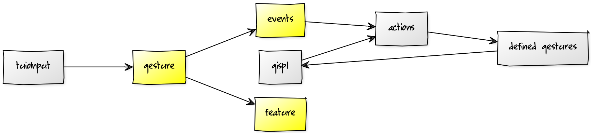

# Validating input as gesture

The process of taking user input and validating it as a user defined gesture is the most important part of the GISpL.js library. It consists of:

* validating the gesture's set of features
* keeping track of which page elements receive the gesture based on gesture flags
* potentially manipulating user input based on gesture options such as duration etc.

A brief overview of how this process works was given in [Recognizing gestures](#recognizing-gestures), and this chapter will cover it in more detail. Specifically, it covers what happens with user input once it reaches a gesture object.

Every user defined gesture is stored as a gesture object. The gesture object contains a `load` method that gets called with user input as an argument, and it either validates the gesture or not. In its core, the gesture object simply delegates the input information to its features. The feature object also contains a `load` method and it reports to the gesture if the input satisifes the conditions of the feature. As an example, user input that is represented by either just one point, or several points with the same coordinates will never satisfy conditions of the `Motion` feature, as it represents user input that does not move. Expanding on Figure {@fig:userinput}, we see in Figure {@fig:gesture} what happens with user input once it gets processed by `tuioInput`. Once a gesture is validated, this information is passed to the `events` object, which is a special object that deals with locating actions for gestures and nodes they are emitted on. It will be discussed in more detail in the next chapter.

{#fig:gesture}

The types of features available are defined by the GISpL specification, and were introduced in their own chapter. As in the original implementation, GISpL.js does not care which features a gesture contains. Once a gesture has been added without errors -- meaning the definition that includes the feature is valid -- it only cares if its feature objects return `true` or `false`. As a consequence, GISpL.js as a library is easily extensible with new features if GISpL as a specification gets extended with additional features in the future.

GISpL.js leans on the original C++ implementation when it comes to actual feature validation, and they are described here in short:

* Motion: validates if an input point contains more than one known position in the path, and if the last two known positions have different values; also, the motion direction can be constrained
* Count: validates if the number of input points match the defined constraint
* Rotation: validates if more than one input point exists, and if the input points are rotated compared to their original position; this is recognized by first calculating a central point between the input points and then measuring the angle formed by original and moving points
* Scale: works in a similar way as rotation, but instead of measuring angle, it measures the distance of the moving point from its original position
* Path: internally uses the $1 Recognizer; it compares the input point paths with the paths from defined gestures and validates if the value produced by the $1 Recognizer is above a threshold
* Delay: validates if the length of the input (in terms of time) matches the defined delay values

Features represent a core element of a defined gesture [@gisplweb], but the GISpL specification allows other parameters that influence the behavior of a gesture.

## Flags

Flags are one such parameter. The key value of a gesture flag is that it can adjust where the gesture event gets triggered. Normally, the element where the input is placed at the time when the gesture is recognized will also receive the gesture event. Flags allow us to change this behavior; there are three types of flags: `oneshot`, `sticky`, and `bubble`. The behavior of the flags is defined in the specification, but it is important to note that of the three types, `bubble` is the one that can potentially cause a gesture event to be triggered on multiple page nodes.

Since the gesture definition itself and subsequently the gesture object contains the flag information, it was the logical place in GISpL.js for deciding how specific flags affect behavior. More simply put, this means that the gesture object's `load` method returns a list of page nodes that are affected by the gesture. This is in contrast with the feature object's `load` method that returns a boolean value. It also means that when a gesture was not recognized, an empty list will be returned.

Going back to the example from [Recognizing gestures](#recognizing-gestures), we see the changes in the code example below.

```
nodesInput.forEach(function forAllNodes(inputObjects, node) {
    userDefinedGestures.forEach(function forAllGestures(gesture) {
        let nodes = gesture.load(inputObjects),
            eventName = gesture.name();
        // emit gesture on all relevant nodes
        nodes.forEach(function emitOnNodes(node) {
            events.emit(node, eventName);
        });
    });
});
```

Where the gesture was previously triggered for the current node only, it now deals with the fact that the node to trigger on might not be the current node, nor is it necessarily the only one.

## Duration
Another additional parameter for gestures is the duration. In short, it allows the user defining the gesture to select just a part of the user input history, and not the whole user input. It can be defined either for the whole gesture, or individual features. The GISpL specification gives an example of a double click, shown shortened below:

```
{
  "name":"doubleclick",
  "features":[
    {"type":"Count", "constraints":[0,0], "duration":[150,100]},
    {"type":"Count", "constraints":[1,1], "duration":[100, 50]},
    {"type":"Count", "constraints":[0,0], "duration":[ 50,  1]},
    {"type":"Count", "constraints":[1,1], "duration":[      1]}
  ]
}
```

This can be interpreted as:

* look at the input between 150 and 100 time units, and find exactly 0 input points
* look at the input between 100 and 50 time units, and find exactly 1 input point
* etc.

As a reminder, Tuio.js is a library that keeps track of various TUIO input types. We can use it to retreive a list of e.g. cursors, and the individual cursors will contain information such as position or path, including time stamps. Theoretically, we are then able to extract the relevant part of the input as specified by the duration parameter. Unfortunately, this specific example will not work because Tuio.js keeps track only of active input. This means that we are not able to verify that at one point in the past there was **no** user input because all information is lost once input is removed from the screen. Simply put, Tuio.js can only inform us is we have current input or not.

The solution was to modify `tuioInput` to not only sort the current input, but also to keep a history of `n` input points, where `n` is a number that can be defined by the user. The history is along with the current input passed to the gesture's `load` method, and if the gesture or its features contain the duration parameter, they will extract the relevant input from the history, and not use the current input.

## Filters
Filters are a parameter that is the simplest among the ones previously mentioned. They allow a gesture to filter out input depending on type. Input with the id that does not match the filter will not validate a gesture; the gesture or feature object will save a lot of work if they are able to invalidate input based on a mismatched filter. They are set as a bit mask meaning all of the 32 possible types can be filtered by flipping the 32 bits of the filter. As an example, a filter set as e.g. `4` or `0b100` will allow only input types with the id of 3, and a filter set as e.g. 3 or `0b11` will accept input with the id of 1 or 2 as only they correspond with the flipped bits. Because this is usually rarely used in JavaScript code, GISpL.js offers a helper method, so it is possible to define a filter by using a list of accepted input types, as shown in the example below.

```
...
"filters": gispl.filterBitmask([1, 2, 3, 4])
...
```

This will set the filter value as `0b1111` or `15`.

## Gesture bubbling
It was noted that what was defined as a region in the GISpL specification is interpreted as a DOM node when GISpL is used in the browser. Also, as gestures are implemented as events, they are implemented in a way typical for the browser, and native events such as `mouseover` bubble from child nodes to parent nodes. When an event, e.g. `mouseover` is triggered on the target -- in the example case when the mouse cursor is over an image -- it will continue to bubble upward to target's parents. Parents in this case being other DOM nodes that contain the target. GISpL.js implements identical behavior for gesture events -- a gesture event will therefore trigger not only on target node, but also on its parents. This makes it possible to, for instance, not implement "regions" at all by simply adding all gesture callbacks to the `document` node. Because it is the root DOM node, all the triggered gestures will eventuall bubble up to it. GISpL.js offers additional levels of control regarding this feature that are discussed in the next chapter.
   